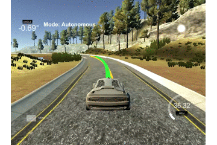
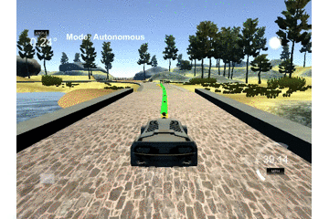
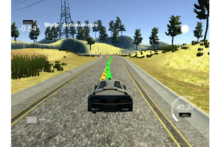
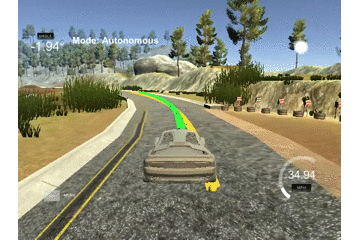

# Model Predictive Control
Drive a simulation car around a track with MPC

---

## Dependencies

* cmake >= 3.5
 * All OSes: [click here for installation instructions](https://cmake.org/install/)
* make >= 4.1(mac, linux), 3.81(Windows)
  * Linux: make is installed by default on most Linux distros
  * Mac: [install Xcode command line tools to get make](https://developer.apple.com/xcode/features/)
  * Windows: [Click here for installation instructions](http://gnuwin32.sourceforge.net/packages/make.htm)
* gcc/g++ >= 5.4
  * Linux: gcc / g++ is installed by default on most Linux distros
  * Mac: same deal as make - [install Xcode command line tools]((https://developer.apple.com/xcode/features/)
  * Windows: recommend using [MinGW](http://www.mingw.org/)
* [uWebSockets](https://github.com/uWebSockets/uWebSockets)
  * Run either `install-mac.sh` or `install-ubuntu.sh`.
  * If you install from source, checkout to commit `e94b6e1`, i.e.
    ```
    git clone https://github.com/uWebSockets/uWebSockets
    cd uWebSockets
    git checkout e94b6e1
    ```
    Some function signatures have changed in v0.14.x. See [this PR](https://github.com/udacity/CarND-MPC-Project/pull/3) for more details.

* **Ipopt and CppAD:** Please refer to [this document](https://github.com/udacity/CarND-MPC-Project/blob/master/install_Ipopt_CppAD.md) for installation instructions.
* [Eigen](http://eigen.tuxfamily.org/index.php?title=Main_Page). This is already part of the repo so you shouldn't have to worry about it.
* Simulator. You can download these from the [releases tab](https://github.com/udacity/self-driving-car-sim/releases).
* Not a dependency but read the [DATA.md](./DATA.md) for a description of the data sent back from the simulator.


## Basic Build Instructions

1. Clone this repo.
2. Make a build directory: `mkdir build && cd build`
3. Compile: `cmake .. && make`
4. Run it: `./mpc`.

## Implementation

* Transform input waypoint to another coordinate at (0,0) and angle 0 degrees, this will help to map and visualize data more simple and track only y coordinate

  Input data is `[ptsx, ptsy, x, y, psi, speed, steering_angle, throttle]` where ptsx and ptsy are the coordinate of the waypoint

* Add latency of 100 milliseconds to the input to reflect real-world control
* Fit the waypoint to 3rd order equation so we have `coeffs` value represent a yellow line I want to track on
* Building state model 

  the state is x,y,psi,speed,cte,epsi
  `state << 0,0,0,v,cte,epsi` because we transfer coordinate to (0,0) origin and angle 0 degree

* Build `fg` of ADvector, a vector of the cost constraints
* Let [Ipopt](https://projects.coin-or.org/Ipopt/) to find locally optimal values of x,y,cte, epsi, delta(steering) and a(throttle)
* Feeding x,y to visualize the green line tracking the waypoint yellow line
* Feeding steering and throttle values to the simulator to drive a car
* Last but not least adjust hyperparameters
  * `N` number of step ahead to calculate; I pick 10 after trial and error, 10 seems to gave the best result
  * `dt` time step for each `N`; I pick 0.15 sec which 10*0.15 = 1.5 seconds ahead of time 
  * ratio of each cost functions I want to optimize on at the end I want to minimize the cost to as minimal as possible
  ```
      // 200 is a multiplier to signal that I want to penalize the cte and the reference compare to v_start(throttle)      
      fg[0] += 200 * CppAD::pow(vars[cte_start + i] - ref_cte,2);
      fg[0] += 200 * CppAD::pow(vars[epsi_start + i] - ref_epsi,2);
      fg[0] += CppAD::pow(vars[v_start + i] - ref_v,2);
  ```

## Personal Tips  

Adjust options for IPOPT solver, otherwise, you will spend hours to debug your code and turn out because I don't give much time for IPOPT to use CPU for calculation
```

// before it set to 0.5 sec which not enough for certain slow PC like mine :)
options += "Numeric max_cpu_time          50\n";
```

Turn off `cout` printing log is slowing down the process, a program in general if you want to optimize for an optimal solution not debugging, turning it off.

## Result

Driving around the lap with 40 mph







For the video of full track you can see it from [here](asset/full_lap.mp4)